# Kola — Project Graph

Compact architecture context for agents. Read with `AGENTS.md` and `docs/PROJECT_STATE.md` before long specs.

## 1. Application architecture

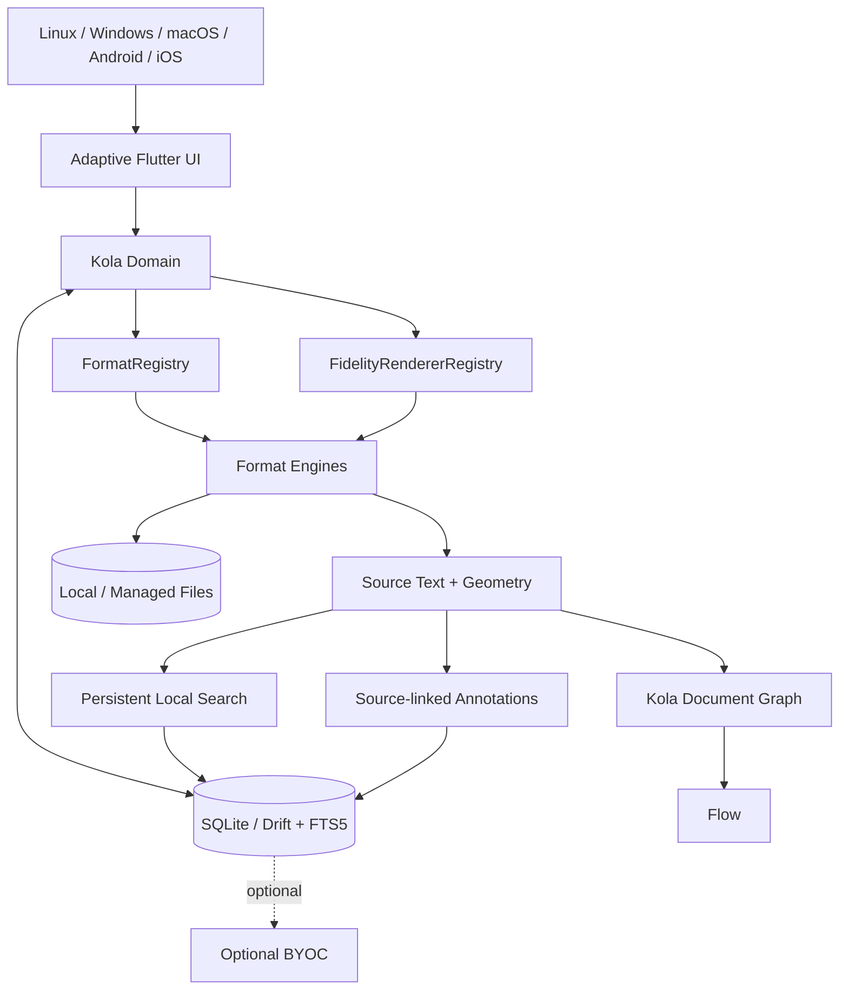

Local reading/search/annotation never depends on sync.

## 2. Import + identity

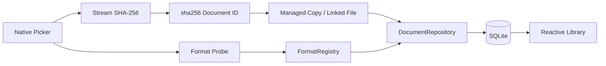

Rules: originals untouched; identical bytes share identity; unknown formats do not mutate library; managed copies are durable.

## 3. Current PDF reader path

```mermaid
flowchart LR
    Route[reader/:documentId]
    Repo[DocumentRepository]
    Doc[KolaDocument]
    Fidelity[FidelityRendererRegistry]
    Resolver[DocumentSourceResolver]
    View[PdfrxPdfFidelityRenderer]
    PDFium[pdfrx / PDFium]
    Pages[Real PDF Pages]

    Route --> Repo --> Doc --> Fidelity --> View --> Resolver --> PDFium --> Pages
```

Generic Reader code does not import `pdfrx`.

## 4. PDF source-text extraction

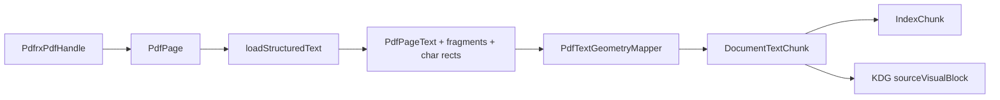

PDF geometry stays in PDF page points (bottom-left origin), never viewer pixels.

## 5. Persistent local search

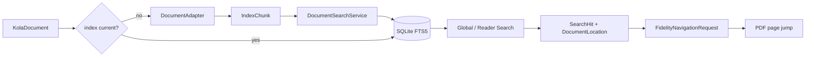

Search is format-neutral and source-locator based.

## 6. PDF highlight creation

```mermaid
flowchart LR
    Select[pdfrx text selection]
    Ranges[PdfPageTextRange + fragment rects]
    KolaSel[DocumentTextSelection]
    Service[AnnotationCreationService]
    Anchor[AnnotationAnchor]
    Repo[AnnotationRepository]
    DB[(SQLite)]
    Live[annotationsProvider]
    Highlight[FidelityTextHighlight]
    Paint[PDF page paint callback]

    Select --> Ranges --> KolaSel --> Service --> Anchor --> Repo --> DB
    DB --> Live --> Highlight --> Paint
```

Anchors preserve source locator, exact quote/context, logical range when available, per-page fallback ranges, and PDF-point geometry.

## 7. Annotation management

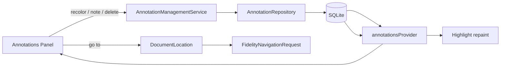

Recolor/note edits preserve the source anchor and increment revision. Delete writes `deletedAt`; live queries hide tombstones.

## 8. Reading-position persistence

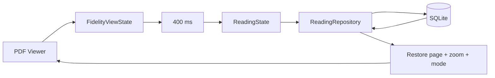

Position is distinct from coverage and active reading time.

## 9. PDF capability state

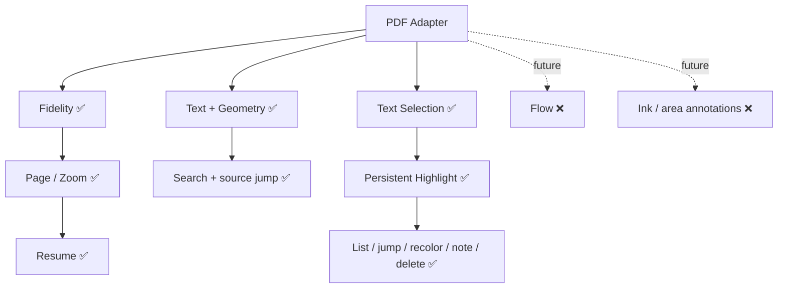

Capability flags describe integrated Kola behavior, not engine primitives.

## 10. Universal adapter + fidelity boundary

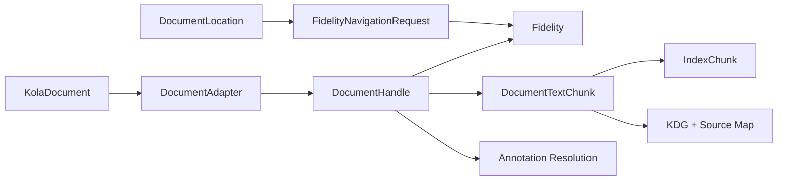

Engine-specific objects are mapped to Kola-owned models before leaving adapters.

## 11. Persistence boundary

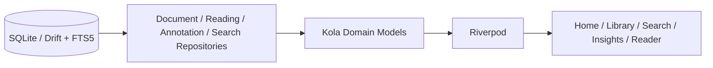

Drift row types never escape the data layer; datetime raw writes use UTC ISO-8601.

## 12. Adaptive-native policy

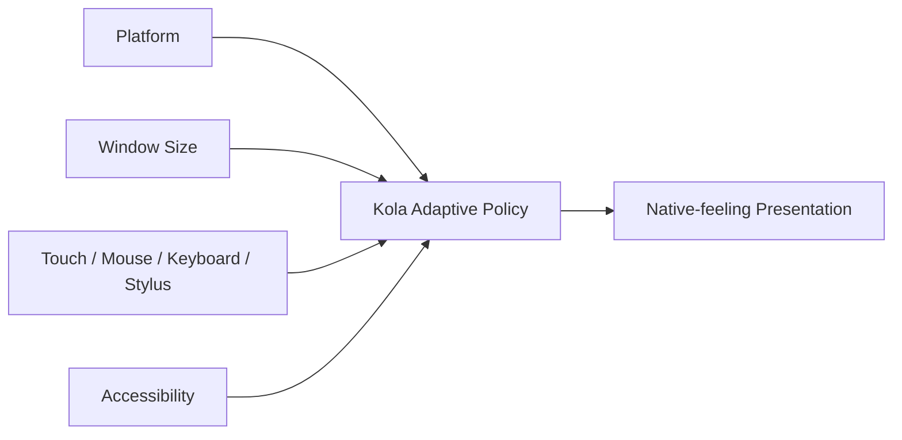

## 13. Optional BYOC

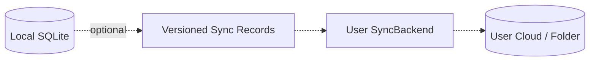

Never sync the live SQLite file. Sync failures never block local reading.

## 14. Agent patch protocol

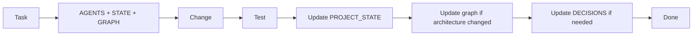
