# Kola — Project Graph

Compact visual context for agents. Read with `AGENTS.md` and `docs/PROJECT_STATE.md` before opening long-form specs.

## 1. System architecture

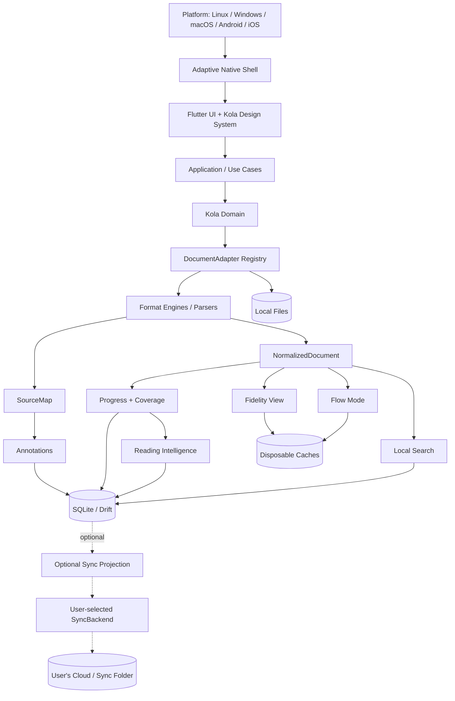

Local reading never depends on the sync path.

## 2. Universal document pipeline

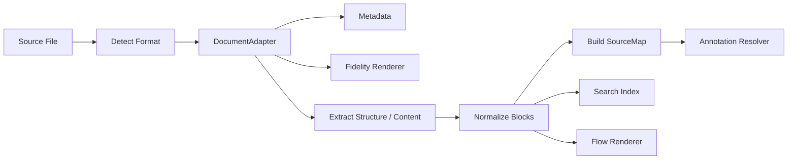

### Adapter families

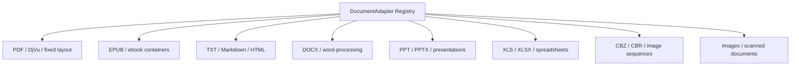

## 3. Flow Mode invariant

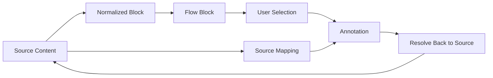

**Rule:** no Flow block containing annotatable content may become detached from its source mapping.

## 4. Annotation anchor resolution

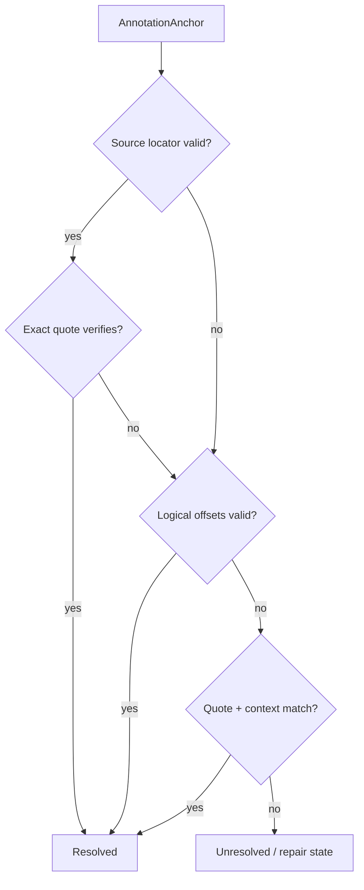

Never silently attach an annotation to a different passage.

## 5. Reading progress

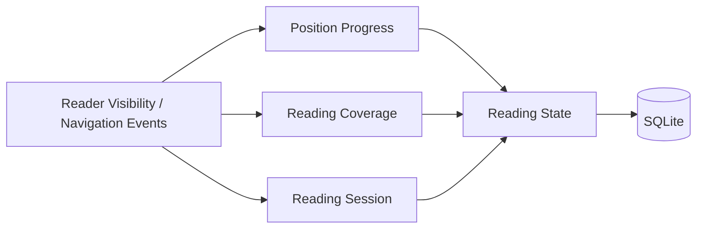

`Position Progress != Reading Coverage`.

## 6. Reading Intelligence

### Active-time tracking

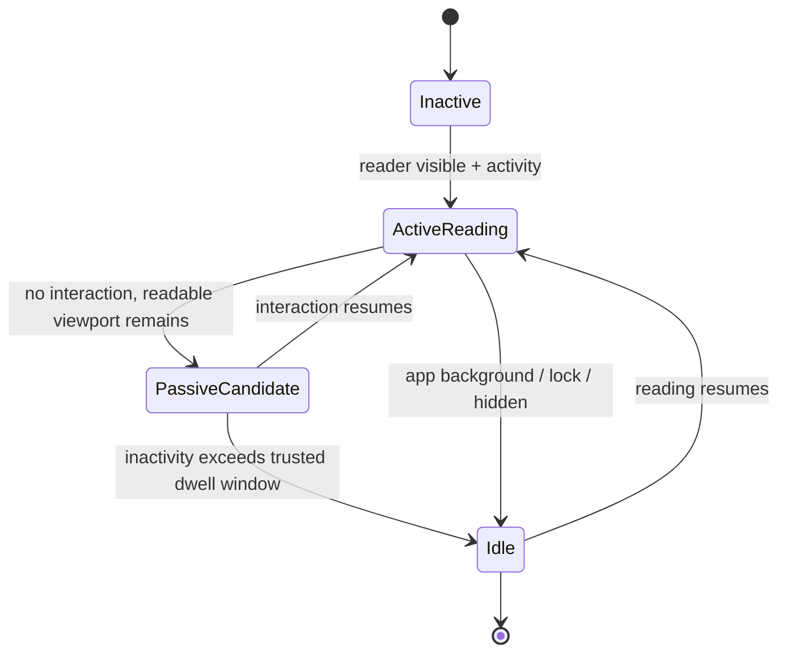

Only trusted reading states contribute to active reading time.

### Analytics pipeline

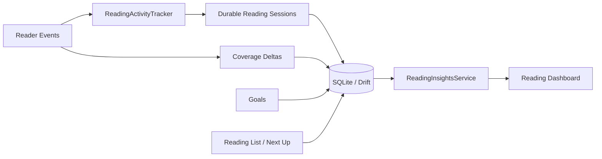

### Reading list states

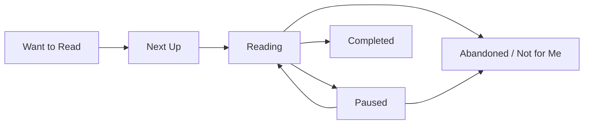

Rules:

- Reading List is separate from Favorites.
- Streaks/goals are optional and secondary.
- Analytics stay local unless explicitly included in BYOC sync.
- Sync durable sessions/list/goals; derive chart aggregates locally.

Detailed design: `docs/READING_ANALYTICS.md`.

## 7. Adaptive-native UX policy

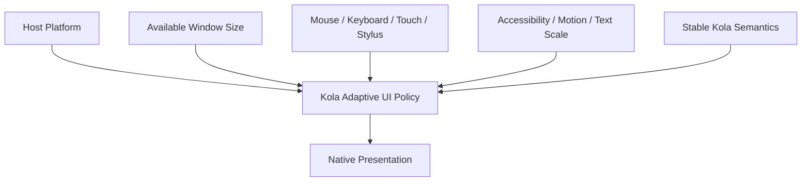

Stable semantics: Library, Search, Collections, Reading List, Insights, Reader, Fidelity View, Flow Mode, Focus Mode, annotations, progress, themes, optional Sync.

Adaptive presentation: navigation, window chrome, sheets/dialogs, menus, back behavior, scrollbars, selection UI, density, haptics, hover/right-click, shortcuts.

## 8. Theme model

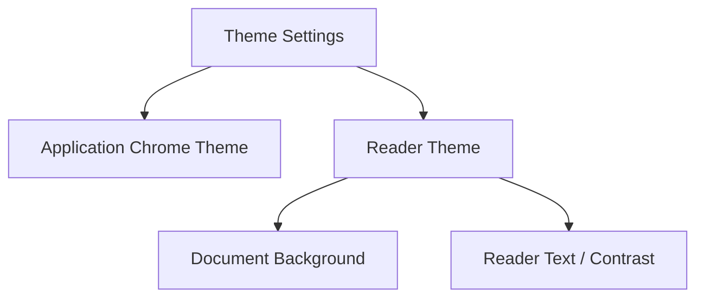

App chrome and reader surface themes are intentionally independent.

## 9. Persistence boundaries

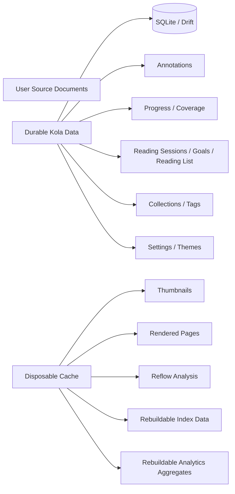

Clearing cache must never delete user-generated data or durable reading history.

### Current reactive application data path

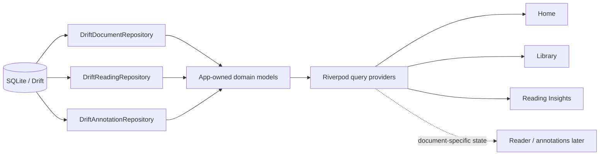

Rules:

- Drift-generated row classes never escape the data layer.
- Repository writes explicitly invalidate affected Drift tables so streams refresh immediately.
- UI consumes Riverpod query providers, not SQL or generated database rows.
- Home, Library, and Insights now use durable local data; the Reader still waits for a real format adapter.

## 10. Bring Your Own Cloud sync

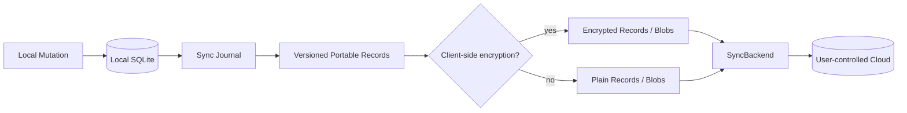

Pull/merge path:

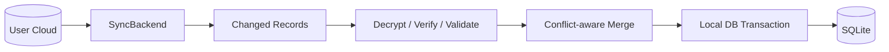

### Sync backend families

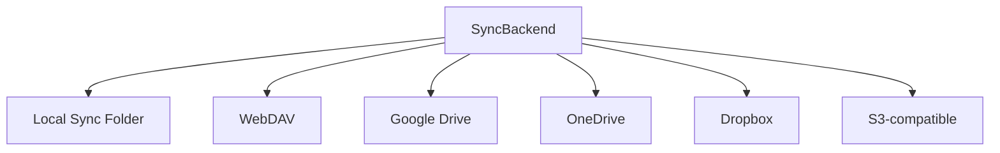

**Rules:** never sync the live SQLite file; sync is optional; local reading continues through all sync failures.

## 11. Evidence-based UX loop

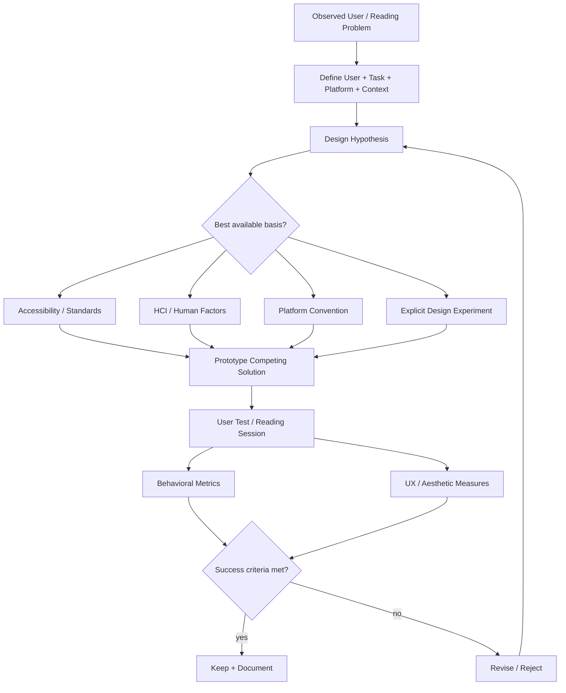

### UX evidence priority

```text
Accessibility/standards
  > validated human-factors evidence
  > native platform convention
  > measured Kola user results
  > visual trend / deliberate experiment
```

Trends are permitted only when they do not undermine the layers above.

Core visual thesis:

```text
Calm reading surface
+ familiar structure
+ high craftsmanship
+ selective expressive interactions
+ platform-native behavior
```

Detailed rationale: `docs/UX_RESEARCH.md`.
Testing protocol: `docs/UX_VALIDATION.md`.

## 12. Agent change protocol

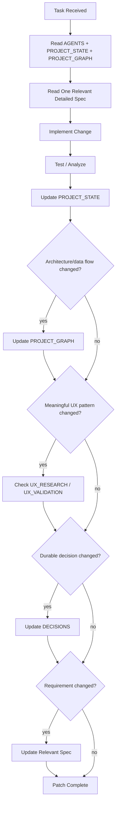

A patch is not complete until this context is synchronized.
