# Kola — Project Graph

Compact architecture context for agents. Read with `AGENTS.md` and `docs/PROJECT_STATE.md` before long specs.

## 1. Application architecture

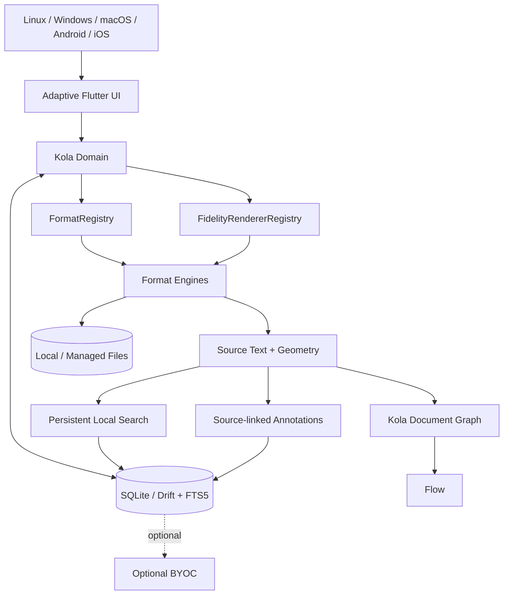

Local reading/search/annotation never depends on sync.

## 2. Import + identity

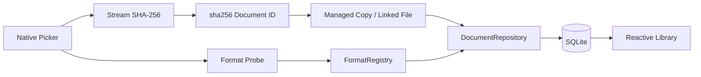

Rules: originals untouched; identical bytes share identity; unknown formats do not mutate library; managed copies are durable.

## 3. Current PDF reader path

```mermaid
flowchart LR
    Route[reader/:documentId]
    Repo[DocumentRepository]
    Doc[KolaDocument]
    Fidelity[FidelityRendererRegistry]
    Resolver[DocumentSourceResolver]
    View[PdfrxPdfFidelityRenderer]
    PDFium[pdfrx / PDFium]
    Pages[Real PDF Pages]

    Route --> Repo --> Doc --> Fidelity --> View --> Resolver --> PDFium --> Pages
```

Generic Reader code does not import `pdfrx`.

## 4. PDF source-text extraction

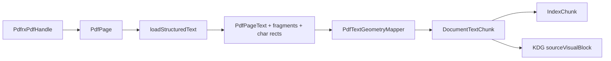

`DocumentTextChunk` preserves full page text, per-character rectangles, fragment ranges/bounds/direction, page extent, rotation, and source location. PDF geometry stays in PDF page points (bottom-left origin), never viewer pixels.

## 5. Persistent local search

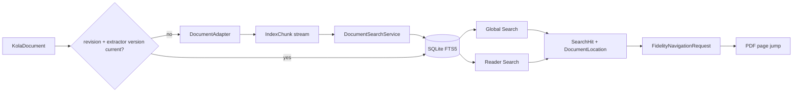

Index rows store document ID, stable source locator, section label, hit kind, and text. Global search includes metadata + content. Reader search returns content hits only. A document revision or extractor-version change invalidates the cached index.

## 6. PDF text selection + highlight persistence

```mermaid
flowchart LR
    Select[pdfrx text selection]
    Ranges[PdfPageTextRange + fragment rects]
    KolaSel[DocumentTextSelection]
    Service[AnnotationCreationService]
    Anchor[AnnotationAnchor]
    Repo[AnnotationRepository]
    DB[(SQLite)]
    Live[annotationsProvider]
    Highlight[FidelityTextHighlight]
    Paint[PDF page paint callback]

    Select --> Ranges --> KolaSel --> Service --> Anchor --> Repo --> DB
    DB --> Live --> Highlight --> Paint
```

Persisted highlight anchors contain stable source locator, exact quote, prefix/suffix context, logical character offsets for single-page selections, per-page fallback ranges, and source-native PDF rectangles. Rendering reads only Kola-owned geometry; screen/viewer coordinates are never persisted.

## 7. Reading-position persistence loop

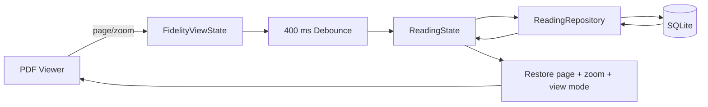

For PDF, `ReadingState.location` uses `scheme=pdf` + 1-based page. Position is distinct from coverage and active reading time.

## 8. PDF capability state

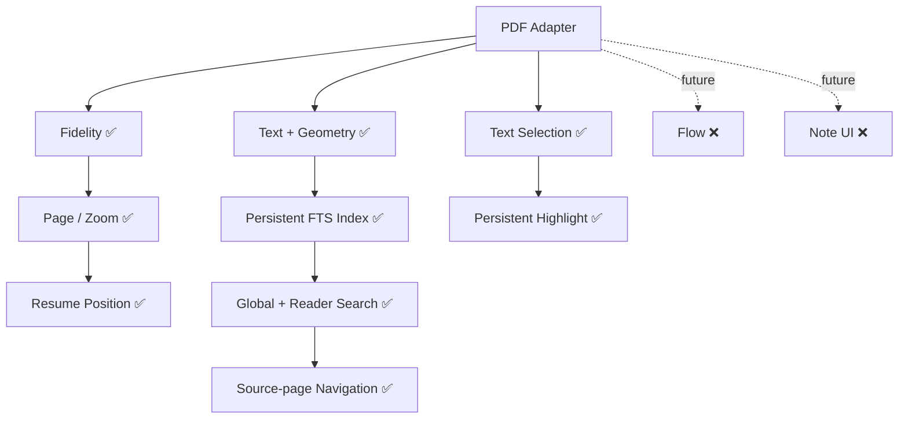

Capability flags describe integrated user-facing Kola behavior. PDF advertises fidelity, text search, text selection, and source-linked text annotations after the highlight path passes CI/device validation. Flow and note-editing UI remain separate work.

## 9. Universal adapter + fidelity boundary

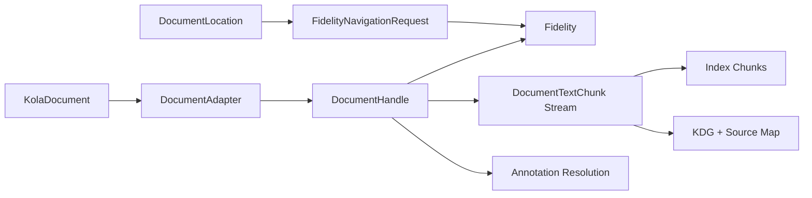

`DocumentAdapter.open()` receives `KolaDocument`, preserving stable identity across file moves. Engine-specific text objects are mapped to Kola-owned source geometry before leaving the adapter. Search navigation uses Kola source locations rather than package controllers.

## 10. Flow + annotation invariant

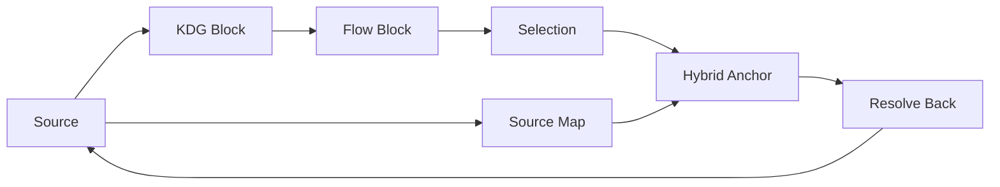

Never enable annotatable Flow/selection unless it resolves back to source reliably.

## 11. Persistence boundary

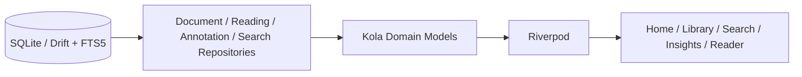

Drift row types never escape the data layer. Raw datetime writes use UTC ISO-8601 strings. Search is local-only and FTS rows are removed when a document is deleted.

## 12. Adaptive-native policy

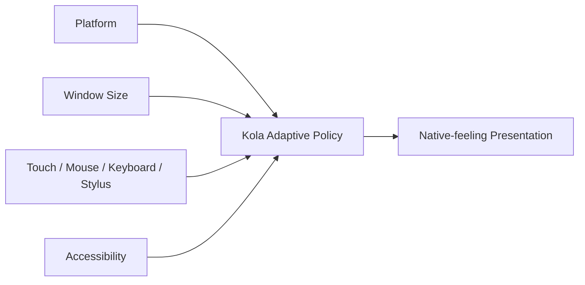

Semantics stay consistent; navigation/chrome/menus/sheets/back/scrollbars/density adapt.

## 13. Optional BYOC

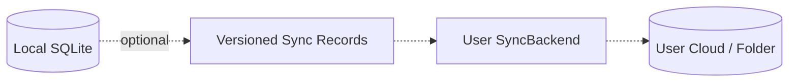

Never sync the live SQLite file. Sync failures never block local reading.

## 14. Agent patch protocol

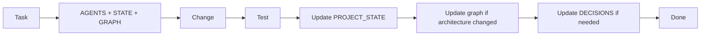
