# Kola — Project Graph

Compact architecture context for agents. Read with `AGENTS.md` and `docs/PROJECT_STATE.md` before long specs.

## 1. Application architecture

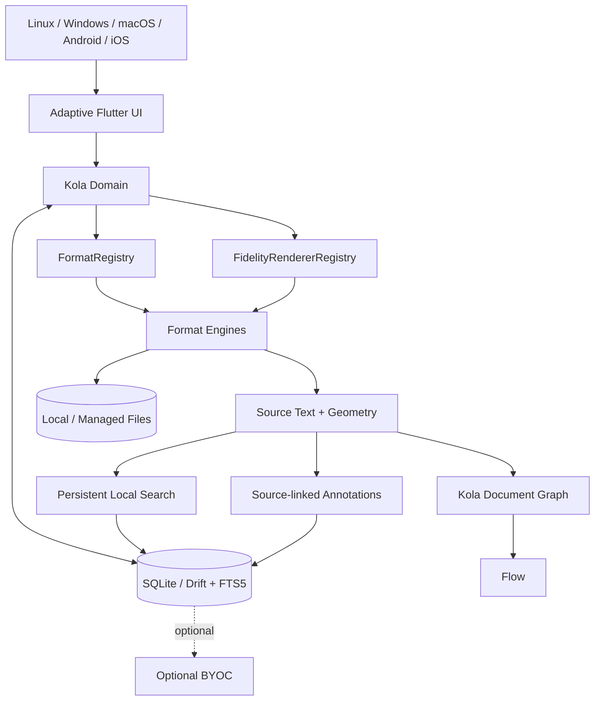

Local reading/search/annotation never depends on sync.

## 2. Import + identity

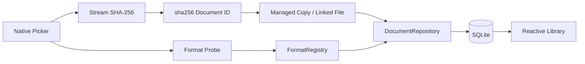

Rules: originals untouched; identical bytes share identity; unknown formats do not mutate library; managed copies are durable.

## 3. Current PDF reader path

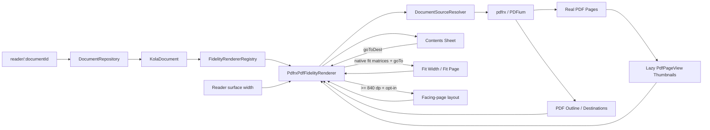

Generic Reader code does not import `pdfrx`.

Reader layout is `SafeArea -> Column -> toolbar + Expanded(fidelity surface)` so source content receives the remaining viewport rather than the toolbar height. Home/Library/Search push reader routes; toolbar Back pops to the origin, with Library as fallback for direct routes. Loading/error states also expose Back. Resume-read failures degrade to a readable source with a notice. Position-save failures are reported without blocking exit; the repository is captured before disposal for system-back flushes.

PDF structure and page-layout navigation stay inside the PDF renderer boundary. The active pdfrx document loads its outline lazily; nested nodes render through progressive disclosure in a Contents sheet; selecting a node uses its engine-native `PdfDest` with `goToDest`. The Pages sheet reuses the active `PdfDocument` and lazily renders `PdfPageView` thumbnails. Fit Width uses `calcMatrixFitWidthForPage`; Fit Page chooses the smaller native width/height fit zoom, centers the active page, and animates through `PdfViewerController.goTo`. Expanded reader surfaces can opt into a facing-page layout that keeps page 1 as the right-side cover and pairs later pages left-to-right. Compact widths force the default vertical single-page layout without discarding the session preference. Layout switches invalidate pdfrx and restore the active page. Missing/failed outlines never block page reading.

## 4. PDF source-text extraction + handle cache

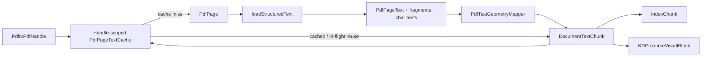

PDF geometry stays in PDF page points (bottom-left origin), never viewer pixels. Cache lifetime is one open document handle; close clears it, and failed page loads are evicted for retry.

## 5. Persistent local search

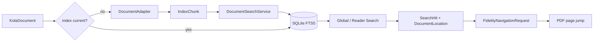

Search is format-neutral and source-locator based.

## 6. PDF highlight creation

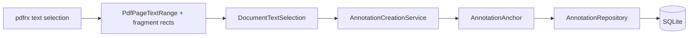

Anchors preserve source locator, exact quote/context, logical range when available, per-page fallback ranges, and PDF-point geometry.

## 7. Annotation management + safe navigation

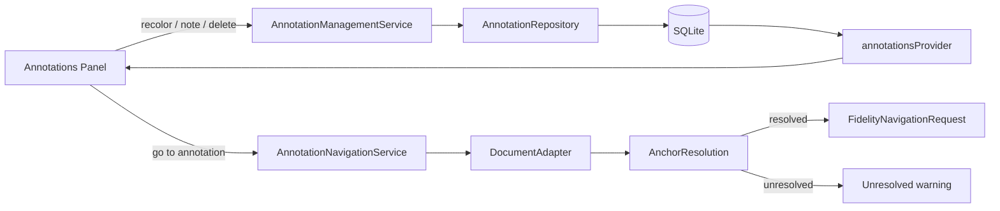

Go-to never trusts a stored locator directly once anchor recovery is available.

## 8. Conservative annotation-anchor recovery

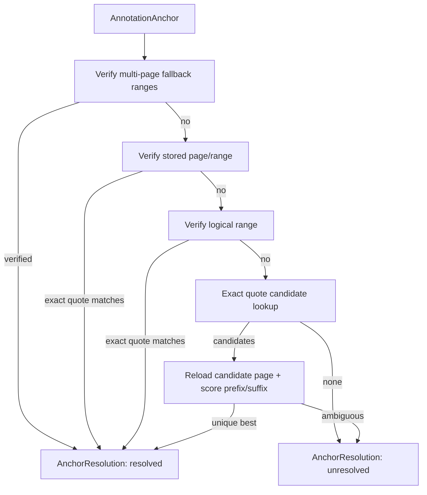

Never silently guess. Candidate indexing changes lookup cost only; context/ambiguity verification remains authoritative.

## 9. Recovery profiling + exact-quote candidate reuse

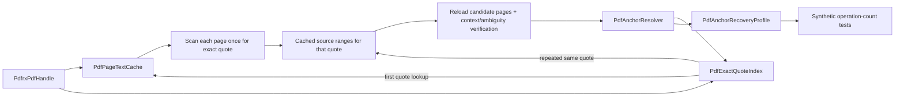

Both caches are local, disposable, and handle-scoped. The measured repeated-quote baseline is expected to fall from 10,000 quote-scan page visits (50 annotations × 200 pages) to 200, while recovery semantics remain unchanged. Unique quotes can still trigger independent scans and require separate measurement before further optimization.

## 10. Recovered highlight geometry

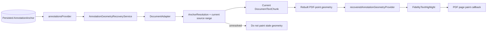

Recovered geometry is transient. It never silently rewrites the persisted anchor. All resolutions within one recovery pass share the open PDF handle and its disposable caches.

## 11. Reading-position persistence

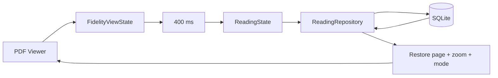

Position is distinct from coverage and active reading time.

## 12. PDF capability state

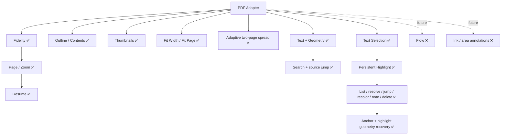

Capability flags describe integrated Kola behavior, not engine primitives.

## 13. Universal adapter + fidelity boundary

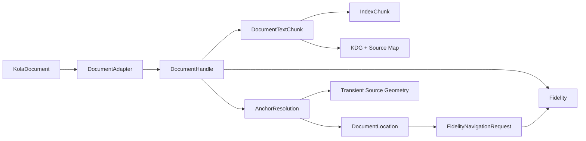

Engine-specific objects are mapped to Kola-owned models before leaving adapters. PDF outline destinations, thumbnail previews, fit transforms, and facing-page layout are renderer-local interactions and do not escape into generic Reader/domain APIs.

## 14. Persistence boundary

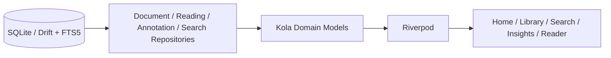

Drift row types never escape the data layer; datetime raw writes use UTC ISO-8601.

## 15. Adaptive-native policy

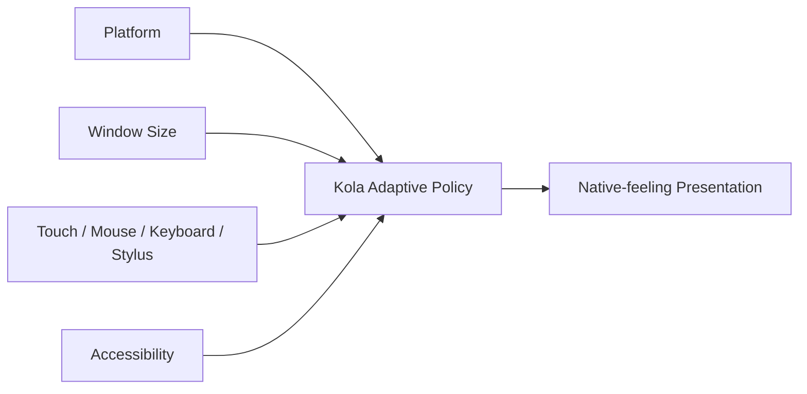

## 16. Optional BYOC

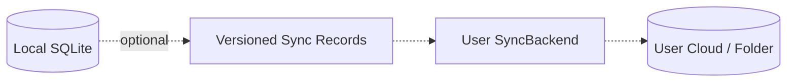

Never sync the live SQLite file. Sync failures never block local reading.

## 17. Agent patch protocol

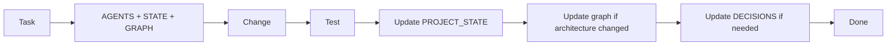
