# Kola — Project Graph

Compact architecture context for agents. Read with `AGENTS.md` and `docs/PROJECT_STATE.md` before long specs.

## 1. Application architecture

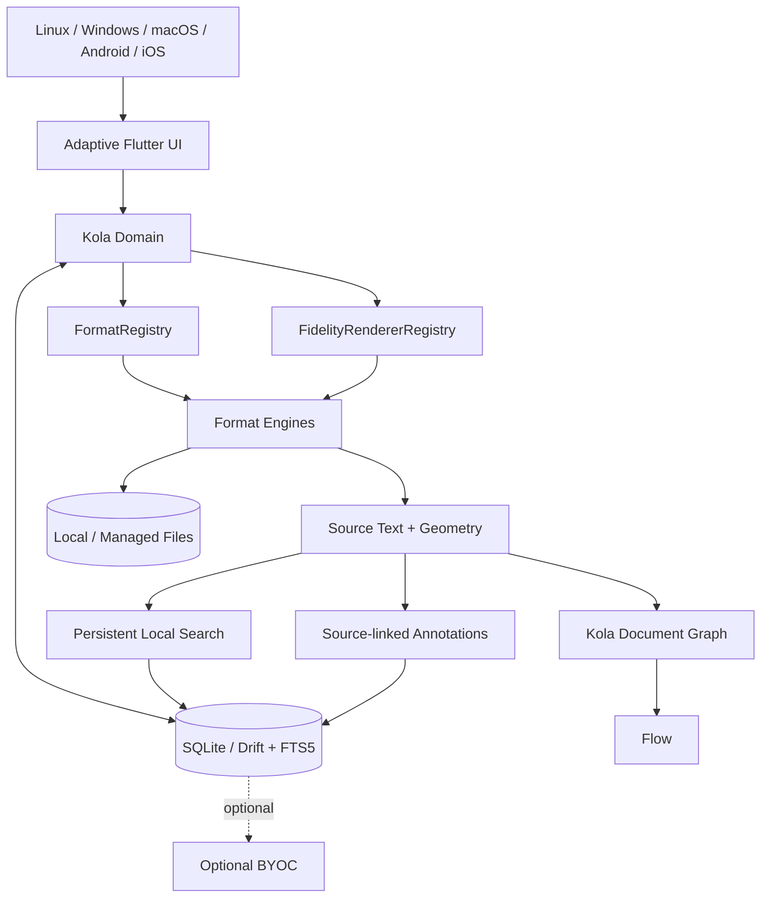

Local reading/search/annotation never depends on sync.

## 2. Import + identity

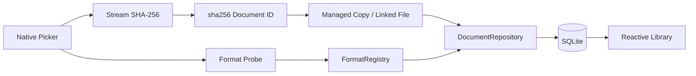

Rules: originals untouched; identical bytes share identity; unknown formats do not mutate library; managed copies are durable.

## 3. Current PDF reader path

```mermaid
flowchart LR
    Route[reader/:documentId]
    Repo[DocumentRepository]
    Doc[KolaDocument]
    Fidelity[FidelityRendererRegistry]
    Resolver[DocumentSourceResolver]
    View[PdfrxPdfFidelityRenderer]
    PDFium[pdfrx / PDFium]
    Pages[Real PDF Pages]

    Route --> Repo --> Doc --> Fidelity --> View --> Resolver --> PDFium --> Pages
```

Generic Reader code does not import `pdfrx`.

## 4. PDF source-text extraction

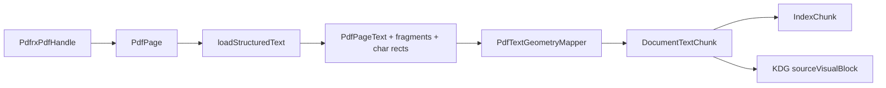

PDF geometry stays in PDF page points (bottom-left origin), never viewer pixels.

## 5. Persistent local search

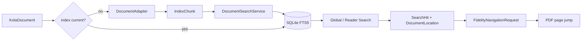

Search is format-neutral and source-locator based.

## 6. PDF highlight creation

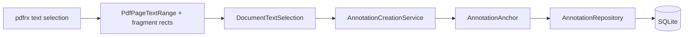

Anchors preserve source locator, exact quote/context, logical range when available, per-page fallback ranges, and PDF-point geometry.

## 7. Annotation management + safe navigation

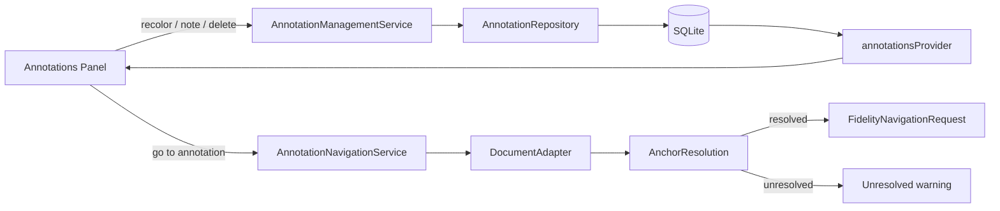

Go-to never trusts a stored locator directly once anchor recovery is available.

## 8. Conservative annotation-anchor recovery

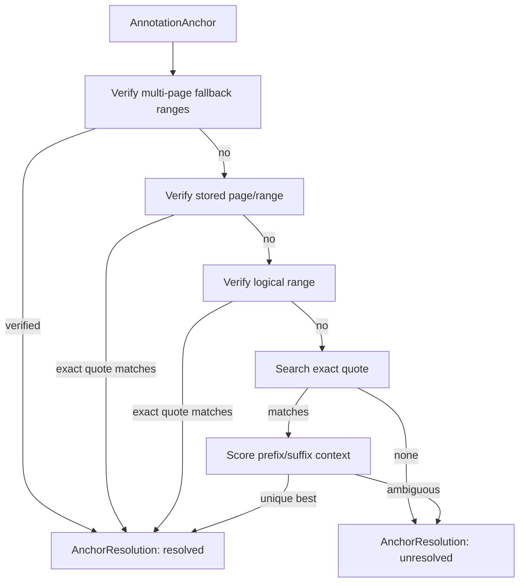

Never silently guess. `AnchorResolution` reports strategy/confidence/reason.

## 9. Recovered highlight geometry

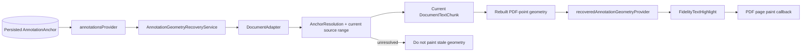

Recovered geometry is transient. It never silently rewrites the persisted anchor.

## 10. Reading-position persistence

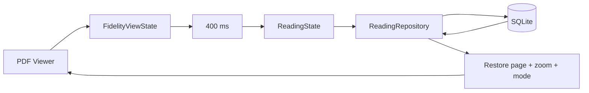

Position is distinct from coverage and active reading time.

## 11. PDF capability state

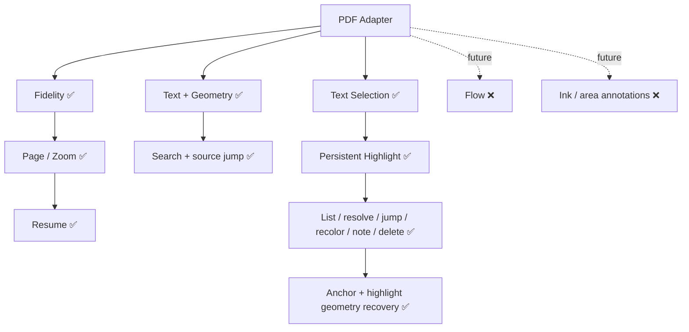

Capability flags describe integrated Kola behavior, not engine primitives.

## 12. Universal adapter + fidelity boundary

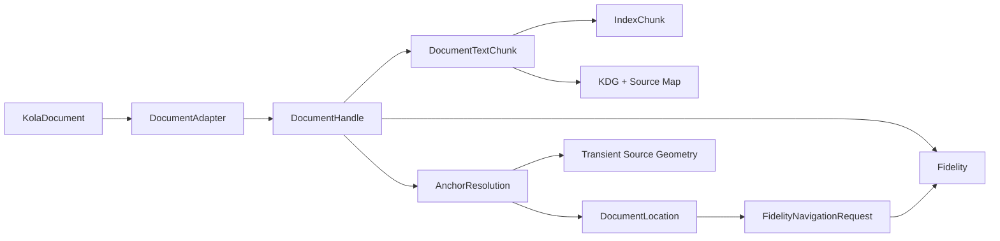

Engine-specific objects are mapped to Kola-owned models before leaving adapters.

## 13. Persistence boundary

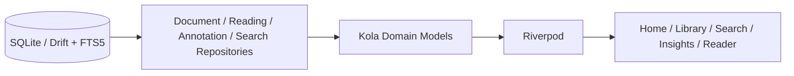

Drift row types never escape the data layer; datetime raw writes use UTC ISO-8601.

## 14. Adaptive-native policy

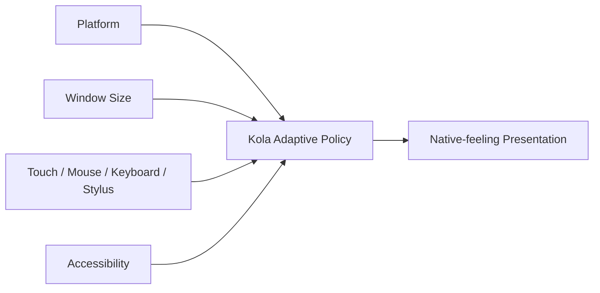

## 15. Optional BYOC

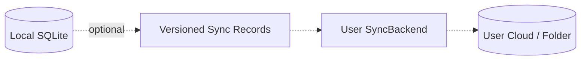

Never sync the live SQLite file. Sync failures never block local reading.

## 16. Agent patch protocol

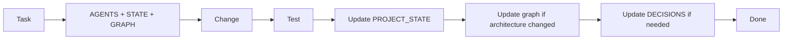
