# Kola — Project Graph

Compact architecture context for agents. Read with `AGENTS.md` and `docs/PROJECT_STATE.md` before long specs.

## 1. Application architecture

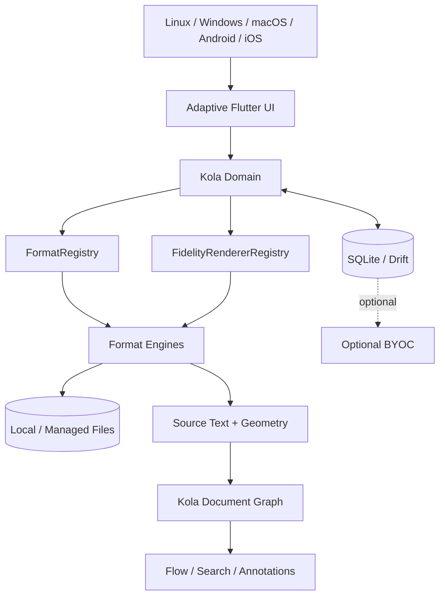

Local reading never depends on sync.

## 2. Import + identity

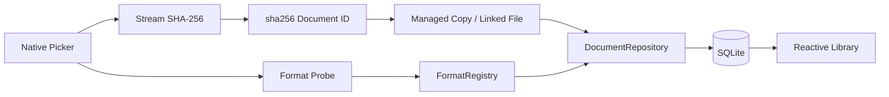

Rules: originals untouched; identical bytes share identity; unknown formats do not mutate library; managed copies are durable.

## 3. Current PDF reader path

```mermaid
flowchart LR
    Route[reader/:documentId]
    Repo[DocumentRepository]
    Doc[KolaDocument]
    Fidelity[FidelityRendererRegistry]
    Resolver[DocumentSourceResolver]
    View[PdfrxPdfFidelityRenderer]
    PDFium[pdfrx / PDFium]
    Pages[Real PDF Pages]

    Route --> Repo --> Doc --> Fidelity --> View --> Resolver --> PDFium --> Pages
```

Generic Reader code does not import `pdfrx`.

## 4. PDF source-text extraction

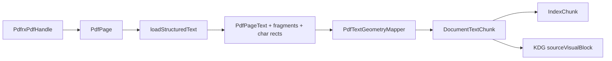

`DocumentTextChunk` preserves full page text, per-character rectangles, fragment ranges/bounds/direction, page extent, rotation, and source location. PDF geometry stays in PDF page points (bottom-left origin), never viewer pixels.

## 5. Reading-position persistence loop

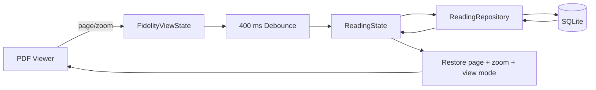

For PDF, `ReadingState.location` uses `scheme=pdf` + 1-based page. Position is distinct from coverage and active reading time.

## 6. PDF capability state

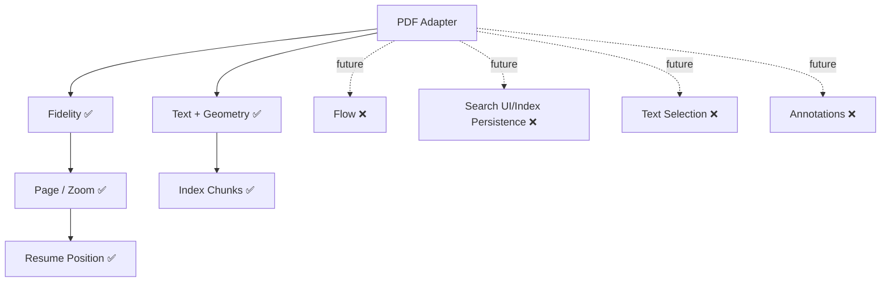

Capability flags describe integrated user-facing Kola behavior, not raw engine primitives. PDF still advertises fidelity only until search/selection/annotation integrations exist.

## 7. Universal adapter boundary

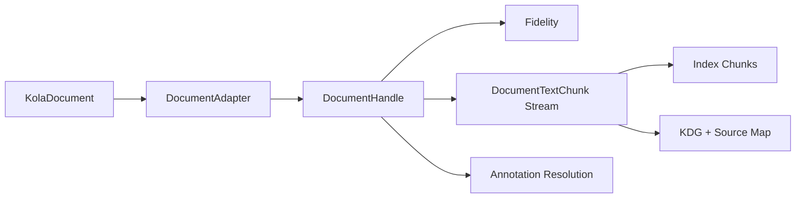

`DocumentAdapter.open()` receives `KolaDocument`, preserving stable identity across file moves. Engine-specific text objects are mapped to Kola-owned source geometry before leaving the adapter.

## 8. Flow + annotation invariant

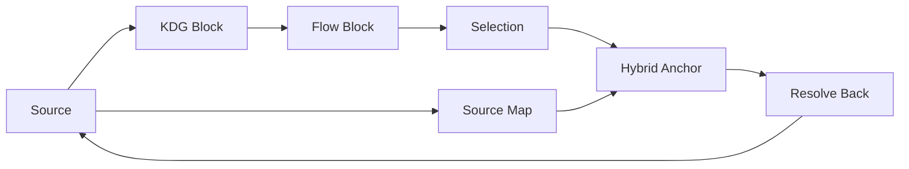

Never enable annotatable Flow/selection unless it resolves back to source reliably.

## 9. Persistence boundary

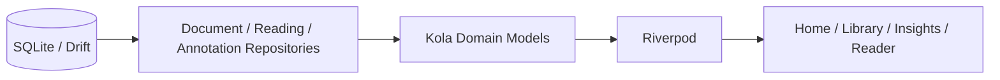

Drift row types never escape the data layer. Raw datetime writes use UTC ISO-8601 strings.

## 10. Adaptive-native policy

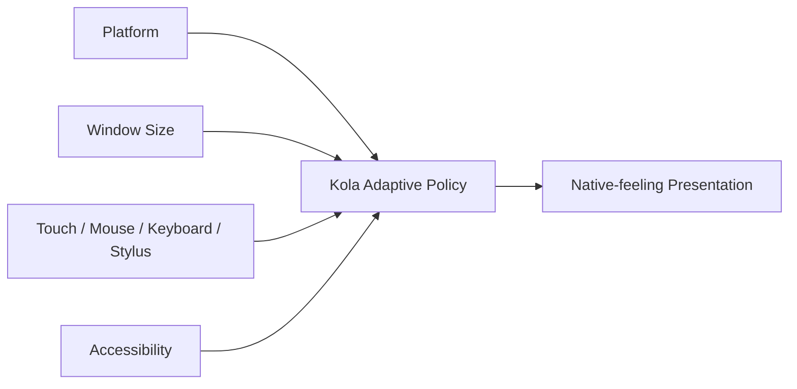

Semantics stay consistent; navigation/chrome/menus/sheets/back/scrollbars/density adapt.

## 11. Optional BYOC

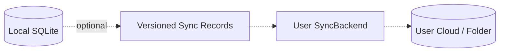

Never sync the live SQLite file. Sync failures never block local reading.

## 12. Agent patch protocol

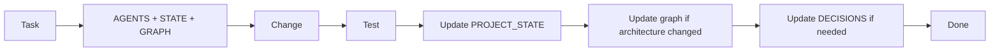
