# Kola — Project Graph

Compact architecture context for agents. Read with `AGENTS.md` and `docs/PROJECT_STATE.md` before opening long specs.

## 1. Application architecture

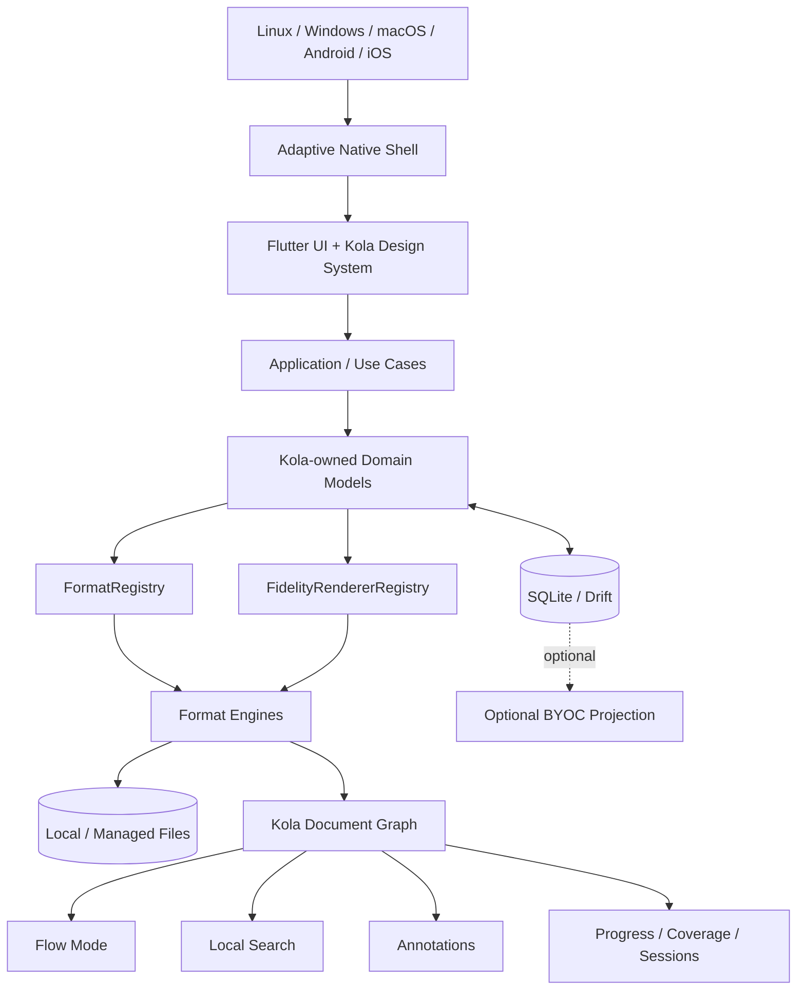

Local reading never depends on sync.

## 2. Import + identity

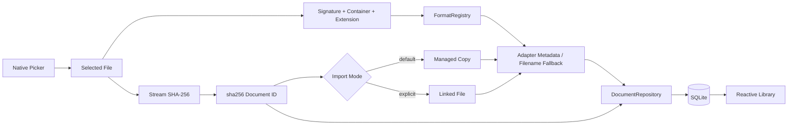

Rules: original files are untouched; identical bytes share identity; unknown formats do not mutate the library; managed copies are durable, not cache.

## 3. Current real PDF reader path

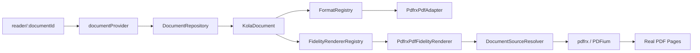

Important boundary:

```text
Generic Reader feature
  -> Kola registries/interfaces
  -> package-specific PDF adapter/renderer
  -> pdfrx/PDFium
```

Generic Reader code must not import `pdfrx`.

## 4. PDF capability state

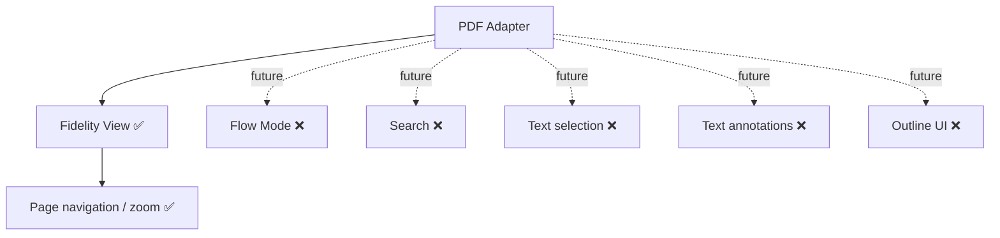

Capability flags describe integrated Kola behavior, not raw engine features.

## 5. Universal adapter contract

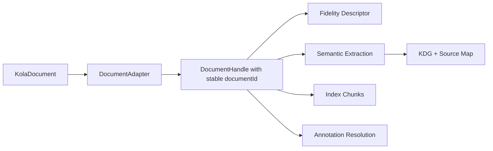

`DocumentAdapter.open()` receives `KolaDocument`, never only a file path, because handles must preserve stable content identity across file moves/renames.

## 6. Flow + annotation invariant

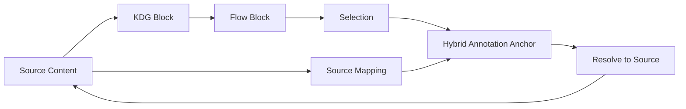

Never enable Flow/selection when annotatable content cannot resolve back to source reliably.

## 7. Persistence/data path

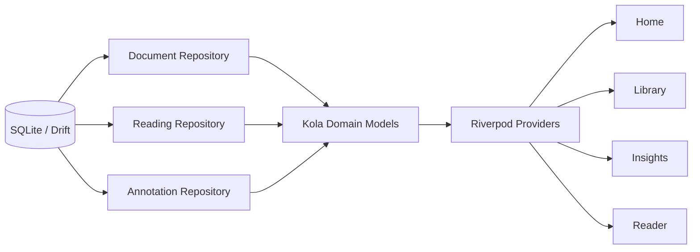

Drift row types never escape the data layer. Raw datetime writes serialize to UTC ISO-8601 strings.

## 8. Reading state model

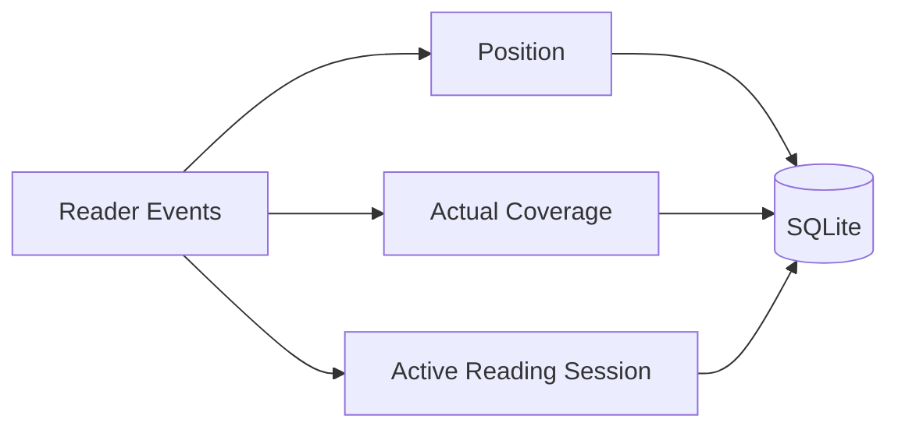

`position != coverage != active reading time`.

## 9. Adaptive-native UI policy

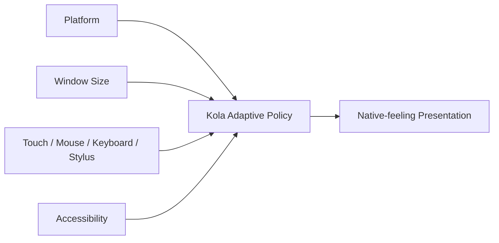

Semantics stay consistent; navigation/chrome/menus/sheets/back/scrollbars/selection/density adapt to platform and capabilities.

## 10. Optional BYOC

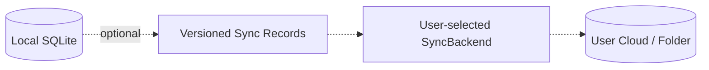

Never sync the live SQLite file. Sync failures never block local reading.

## 11. Agent patch protocol

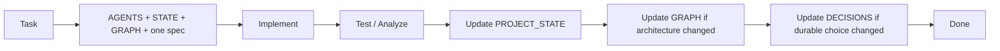
