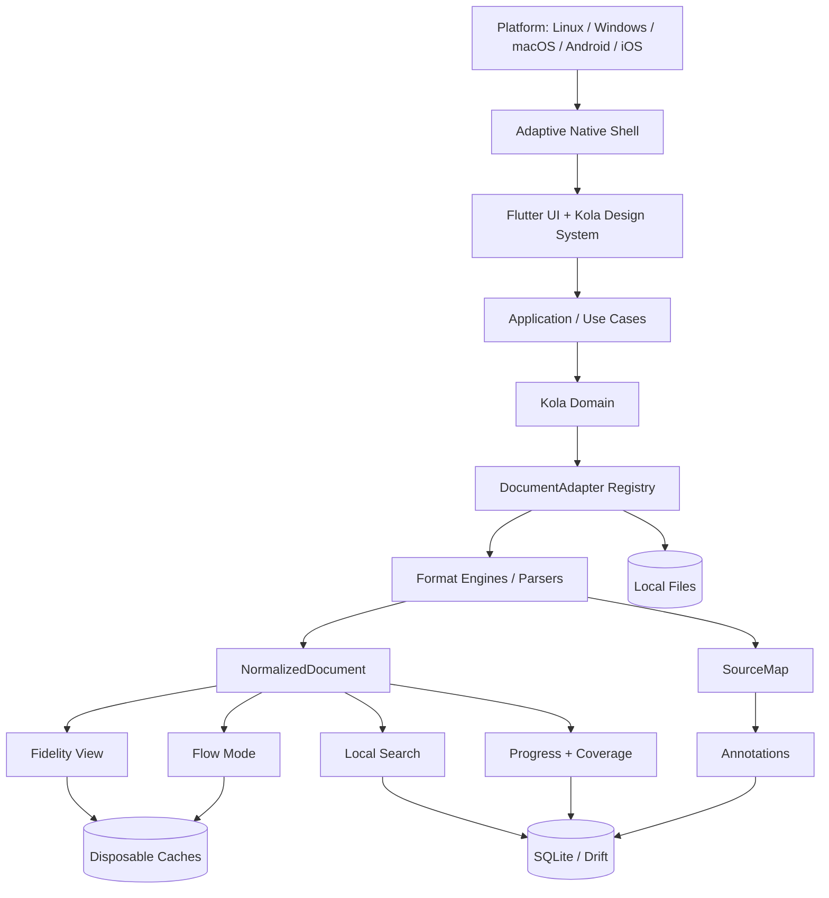
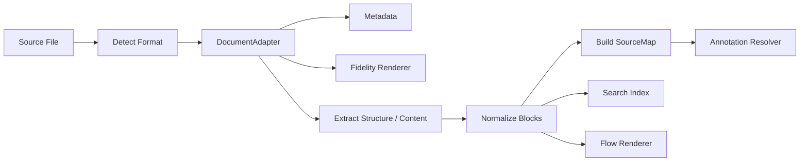
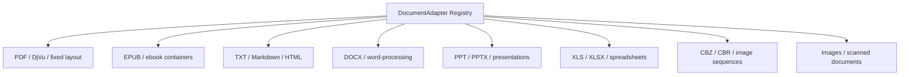
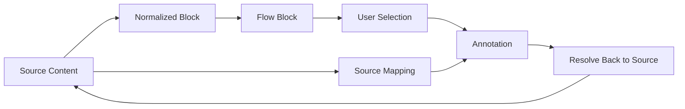
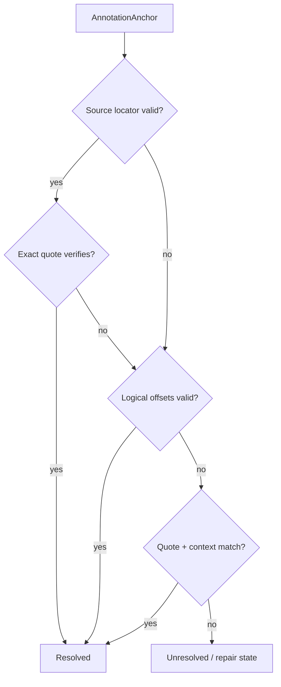
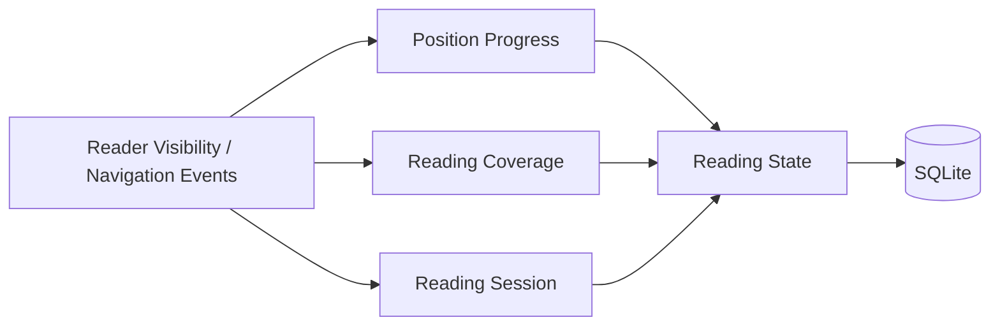
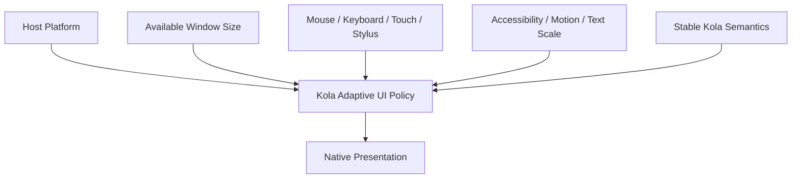
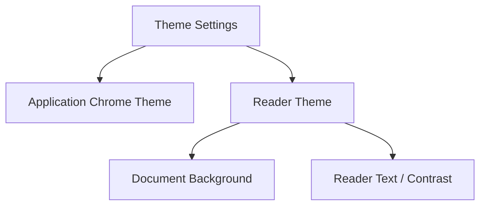
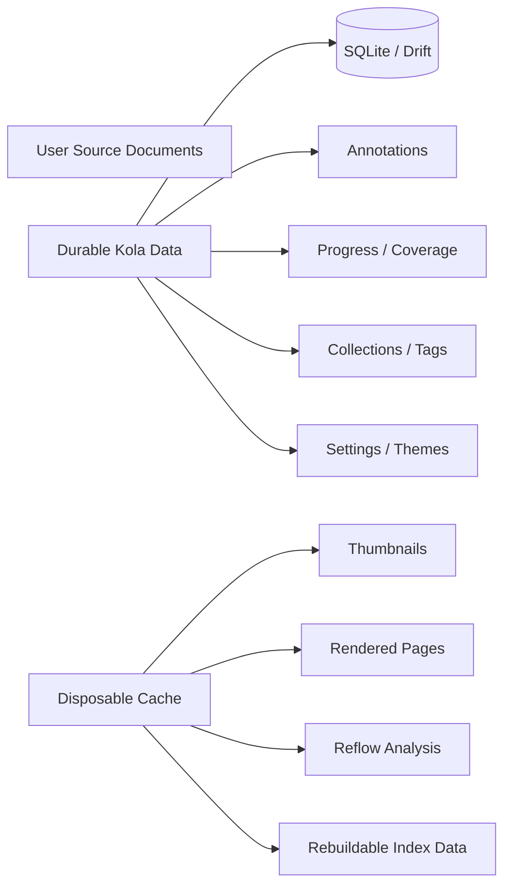
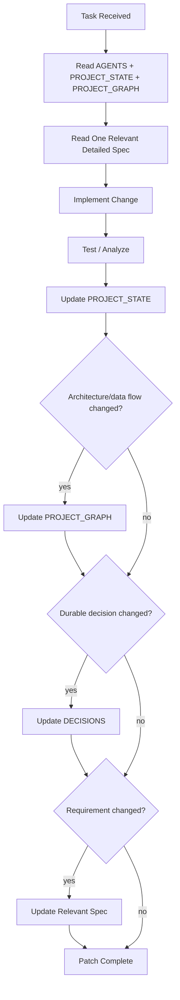

# Kola — Project Graph

Compact visual context for agents. Read with `AGENTS.md` and `docs/PROJECT_STATE.md` before opening long-form specs.

## 1. System architecture

## 2. Universal document pipeline

### Adapter families

## 3. Flow Mode invariant

**Rule:** no Flow block containing annotatable content may become detached from its source mapping.

## 4. Annotation anchor resolution

Never silently attach an annotation to a different passage.

## 5. Reading progress

`Position Progress != Reading Coverage`.

## 6. Adaptive-native UX policy

Stable semantics: Library, Search, Collections, Reader, Fidelity View, Flow Mode, Focus Mode, annotations, progress, themes.

Adaptive presentation: navigation, window chrome, sheets/dialogs, menus, back behavior, scrollbars, selection UI, density, haptics, hover/right-click, shortcuts.

## 7. Theme model

App chrome and reader surface themes are intentionally independent.

## 8. Persistence boundaries

Clearing cache must never delete user-generated data.

## 9. Agent change protocol

A patch is not complete until this context is synchronized.
